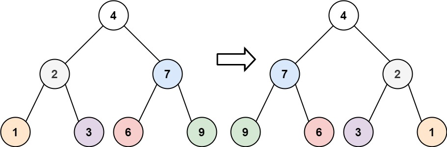
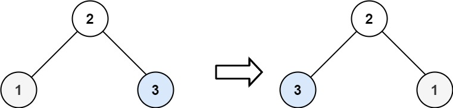

Given the root of a binary tree, invert the tree, and return its root.

Example 1:

Input: `root = [4,2,7,1,3,6,9]`

Output: `[4,7,2,9,6,3,1]`

Example 2:

Input: `root = [2,1,3]`

Output: `[2,3,1]`

Example 3:

Input: `root = []`

Output: `[]`

Constraints:

- The number of nodes in the tree is in the range `[0, 100]`.
- `-100 <= Node.val <= 100`

Companies [`Google`]

Source `Leetcode` - https://leetcode.com/problems/invert-binary-tree/